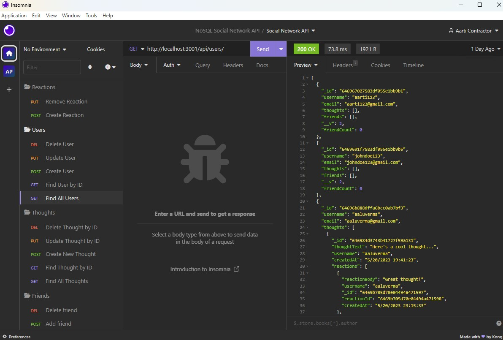
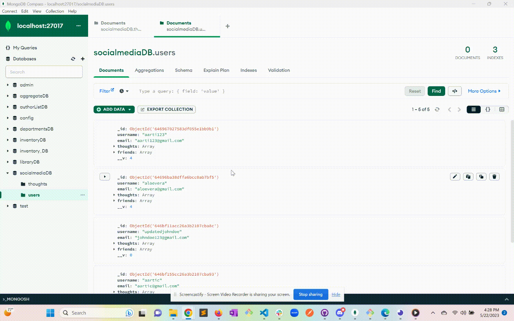

# nosql-social-network-api

## Description

[Watch the Walkthrough Video]()
<br>
NoSQL Social Newtork API - here APIs are built for a social network web application where users can share their thoughts, react to friends’ thoughts, and create a friend list. 
I've used Express.js for routing, a MongoDB database, and the Mongoose ODM, due to its speed with large amounts of data and flexibility with unstructured data.

<br>
<br>


## Technology Used 

| Technology Used         | Resource URL           | 
| ------------- |:-------------:|    
| Git | [https://git-scm.com/](https://git-scm.com/)     |  
| JavaScript | [https://developer.mozilla.org/en-US/docs/Web/JavaScript](https://developer.mozilla.org/en-US/docs/Web/JavaScript) |  
| NodeJs | [https://nodejs.org/en](https://nodejs.org/en) |
| ExpressJS | [https://www.npmjs.com/package/express](https://www.npmjs.com/package/express) |
| Insomnia | [https://insomnia.rest/](https://insomnia.rest/) |
| MongoDB | [https://www.mongodb.com/](https://www.mongodb.com/) |
| Mongoose ODM | [https://www.npmjs.com/package/mongoose](https://www.npmjs.com/package/mongoose) |


<br>
<br>


## Table of Contents

* [Installation](#installation)
* [Application Highlights and Usage](#application-highlights-and-usage)
* [Code Snippets](#code-snippets)
* [Learning Points](#learning-points)
* [Author Info](#author-info)
* [Credits](#credits)

<br>
<br>


## Installation

The 'NoSQL Social Network API' requires installation of mongoDB, and express-ja and mongoose NPM packages.
 After cloning down the repository, go to the command-line in the terminal and do an 'npm install' to install all the dependencies stated in the 'package.json' file and run 'npm run start' or 'npm run develop' to start the server.
<br>
<br>
<br>

## Application Highlights and Usage
<br>


1. The following image shows the APIs made in files and tested on Insomnia:
<br>
<br>




<br>
<br>
2. The following image shows the database named 'socialmedia' created and its collections - Thoughts and Users:
<br>
<br>




<br>
<br>


## Code Snippets

<br>

 The following code snippet shows the use of Regular expressions(regex) to validate an email address in User.js: 

```javascript
const UserSchema = new Schema({
    username: {
        type: String,
        required: true,
        unique: true,
        trim: true
    },
    email: {
        type: String,
        required: true,
        unique: true,
        match: [/.+\@.+\..+/, 'Must match an email address!'] //Using regex to validate email address
    },
    });
```

<br>
<br>

The following code snippet shows how Mongoose was set up with local server in connection.js:

```javascript
//Required mongoose 
const mongoose = require('mongoose');

// Connection of mongoose with the local server
mongoose.connect('mongodb://localhost:27017/socialmediaDB', {
  useNewUrlParser: true,
  useUnifiedTopology: true,
});


module.exports = mongoose.connection;
```


## Learning Points 

   I learned the following skills while doing this project:
<br>
- Java script basics (variables,functions, arrays, for-loops, if-else etc)
- Basics of NodeJs server and related functions
- How to write API routes with MongoDb as the database instead of using MySQL queries
- Using the express and mongoose packages from NPM 
- Creating collections using MongoDB and their associations to create relationships between collections using mongoose.


<br>
<br>

## Author Info

### Aarti Contractor


- Portfolio: https://aarticontractor.github.io/aarticontractor_portfolio/
- Linkedin: https://www.linkedin.com/in/aarti-contractor/
- Github: https://github.com/aarticontractor

<br>

## Credits

- https://developer.mozilla.org/en-US/docs/Web/JavaScript
- https://cloudconvert.com/webm-to-gif
- https://nodejs.org/en
- https://www.npmjs.com/package/express
- https://insomnia.rest/
- https://www.mongodb.com/
- https://www.npmjs.com/package/mongoose


<br>

© 2023 edX Boot Camps LLC. Confidential and Proprietary. All Rights Reserved.